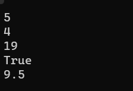
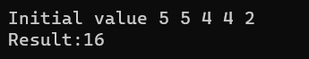

# console_app_csharp

1. Simple Creature

2. Complex Creature 

3. Calculate Average

4. Calculate Temperature

5. Simple Conversion Example

6. Arithmetic operator example 1

7. Arithmetic operator example 2

8. Arithmetic operator example 1

9. Positive or Negative number (If, else if, else)

10. Week day (Switch Case)

11. Simple Calculator
